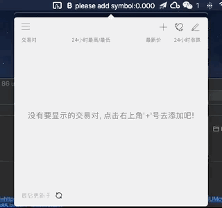
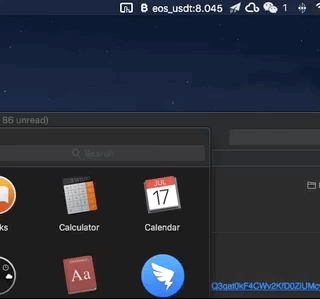
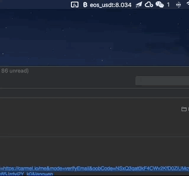

## Features

#### 1. 在主界面添加, 删除, 排序交易对;

#### 2. 设置价格提醒, 当交易对的价格达到设定值时, 会以原生notification的形式弹出通知;

#### 3. 在托盘区轮播交易对的最新价格, 为了配合Mojave, 添加了最新的暗色主题!

## BUILD

1.  `npm install` or `yarn`
2.  `npm run package`

输出应用在`./out`文件夹, 之后你可以将`Coins-Price_Tracker.app`文件夹拷贝到`~/Applications`文件夹以方便在spotlight搜索中打开
